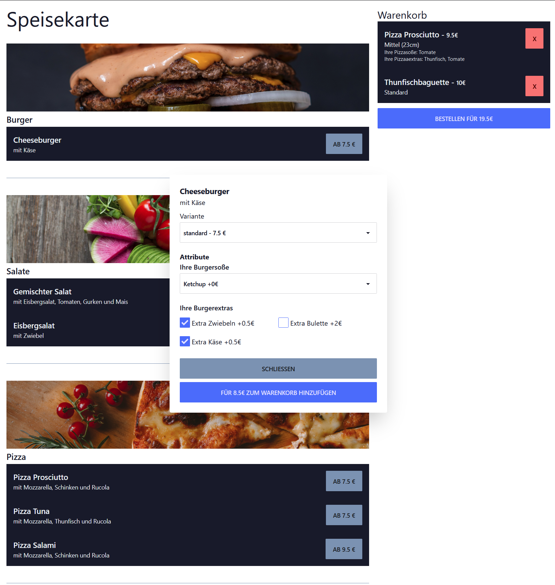

# Projekt - SS2023 - Gastrobit.de

Gastrobit is an alternative to Lieferando.de (the german offshoot of Takeaway.com) and other food ordering platforms. On Gastrobit, restaurants can offer their food for pickup, or delivery by their own staff. Customers can order food from the restaurant, and pay online. This project was done as part of the Software Engineering course at the University of Applied Sciences in Iserlohn, Germany. I never intended this project to be a real product, as the place is too croweded and I'm simply not interested in the food ordering business.

* Easy ordering for customers.
* Restaurant owners can add food to the menu, and **configure
  available toppings, sizes,** and other options.
* Restaurant owners can **configure the delivery area via a map**.
* Restaurant owners can configure a ``*.gastrobit.de`` subdomain, or 
  **use their own domain**.
* Restaurant owners can select one from over **20 themes** for their
  restaurant page.
* Checkout via Stripe.

  

