# Projekt - SS2023 - Gastrobit.de

| Name                  | Matrikelnummer | E-Mail                          |
| --------------------- | -------------- | ------------------------------- |
| Marc-Alexander Richts | 10059445       | richts.marc-alexander@fh-swf.de |

# Ausarbeitung: Entwicklung einer Alternative zu Lieferando

## Ermittlung der Anforderungsaufnahme

Die Anforderungen für unsere Alternative zu Lieferando wurden durch eine Kombination aus Marktforschung und einem Gastronomeninterview ermittelt. Die Hauptanforderungen sind:

- Benutzerfreundliche Oberfläche für den Endkunden
- Responsive Design für mobile Endgeräte beim Kaufvorgang durch Endkunden
- Einfache Bestellprozesse für den Endkunden
- Bezahlungsfunktion für den Endkunden
- Restaurantverwaltung durch den Besitzer (Speisekarte, Erreichbarkeit über eigene Domain/\*.gastrobit.de-Subdomain, Auswahl eines Designs, Festlegung des Liefergebietes, etc.)
- Tracking und Verwaltung des Bestellvorgangs
- Niedrige Kommissionen für Gastronomen


## 2. Identifikation der Anwendungsfälle des Softwareprodukts

Die Anwendungsfälle für unser Produkt wurden identifiziert und in einem Use Case Diagramm dargestellt.


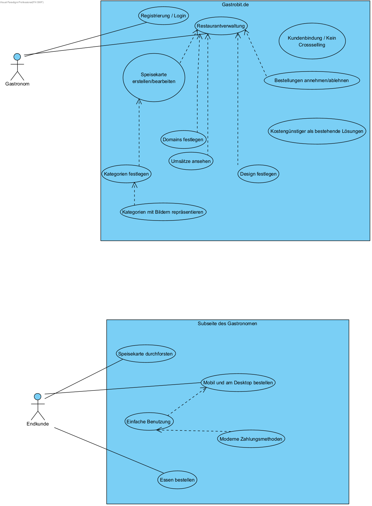

Die Hauptanwendungsfälle sind:

- Registrierung, Login, Passwort zurücksetzen sowie E-Mail ändern für Gastronomen
- Hinzufügen und Verwalten von Restaurants durch den Gastronomen
- Übersicht über Umsätze von den einzelnen Restaurants
- Ändern von Gerichten auf der Speisekarte durch den Gastronomen (Extras (z.B. Käse, Zwiebeln, etc.), Preise, Varianten (große Pizza, kleiner Pizza), Gerichte kategorisieren, etc.)
- Bestellung von Gerichten durch Endkunden
- Bezahlung der Bestellung durch Endkunden
- Verwaltung der Bestellung durch den Gastronomen


## Entwurf einer Benutzungsoberfläche für das Produkt

Die Benutzungsoberfläche wurde mit Wireframes entworfen, um eine benutzerfreundliche und intuitive Navigation zu gewährleisten. Die Hauptelemente der Benutzungsoberfläche sind:

- Startseite mit Übersicht über Restaurants die im Besitz des Gastronomen sind
- Verwaltungsfunktion für Restaurants (festlegen von Domains, Liefergebiet, etc.)
- Restaurantseite mit Speisekarte und Bestellfunktion und Bezahlmöglichkeit für Endkunden

Die Wireframes sind im Anhang A zu finden.

## Herleitung eines Datenmodells

Das Datenmodell wurde auf Basis der identifizierten Anforderungen und Anwendungsfälle erstellt. Es besteht aus folgenden Tabellen:

- Restaurants
- Custom Domains
- Orders
- Users (Verwaltet durch Supabase)

### Restaurants

Diese Tabelle speichert alle Restaurants, die von Gastronomen erstellt wurden. Sie enthält alle wichtigen Informationen, wie beispielsweise den Namen des Restaurants, die User-ID des Gastronomen, die ID des Stripe-Subaccounts (Connect-Express-Account) sowie die Speisekarte als JSON und das Liefergebiet als Koordinatenarray (Längengrad und Breitengrad), welches ein geschlossenes Polygon ergibt.

#### Warum wird die Speisekarte als JSON gespeichert?

Hier wäre die Chance gewesen, um eine weitere Tabelle zu erstellen und eine 1:n-Beziehung zwischen Restaurant und Gerichten zu erstellen. Allerdings ist die Speisekarte ein sehr komplexes Objekt, welches viele Eigenschaften hat und mit den Extra-Attributen, Varianten und verschiedenen Preisen wären die JOINs sehr komplex geworden. Zudem wird die Speisekarte _immer_ komplett an den Nutzer ausgegeben, und es werden keine Teilabfragen benötigt. Daher war es für uns sinnvoller, die Speisekarte als JSON zu speichern.

#### Polygon? Liefergebiet?

Wir hatten mehrere Ansätze um ein Liefergebiet zu definieren.

1. **Radius um das Restaurant.** Dies wäre der simpelste Ansatz gewesen, jedoch fallen hier schnell die Limitierungen dieser unflexiblen Lösung auf: Nehmen wir einfach die Stadt Hamburg, die durch die Elbe horizontal getrennt ist. Ein Gastronom möchte beispielsweise in Hamburg nur den nördlichen Teil der Elbe bedinenen, da eine Fahrt durch den Elbtunnel für den Lieferanten zu lange dauert. Ein primitiver Radius würde dies nicht ermöglichen.

2. **Postleitzahlen.** Ein ähnliches Gebiet wie bei dem Radius: Postleitzahlengebiete sind teilweise sehr groß und können Gebiete abdecken, die durch große Hindernisse (wie der oben beschriebene Elbtunnel) geographisch getrennt sind. Außerdem war es mir nicht möglich, eine Datenbank mit Postleitzahlen zu finden, die auch die Koordinaten der Postleitzahlen enthält.

3. **Polygon.** Ein Polygon ist ein geschlossenes Gebiet, welches durch Koordinaten definiert wird. Dies ermöglicht es, sehr komplexe Gebiete zu definieren, die auch natürliche Hindernisse wie Flüsse oder Autobahnen berücksichtigen. Beim Bestellprozess wird nun OpenStreetMaps.com mit der Adresse des Kunden kontaktiert, um die Lieferadresse zu Koordinaten aufzulösen, und dann wird mit der Hilfe des "Point Inclusion in Polygon Test"-Algortihmus festgestellt, ob sich dieser Punkt im Polygon befindet. Siehe dazu den Algorithmenabschnitt in Kapitel 5.
   **Dies ist die finale Lösung, die in diesem Projekt verwendet wurde, da sie die größte Flexbilität bietet und besser an die spezifischen Bedürfnisse der Gastronomen angepasst werden kann.**


### Custom Domains

Eine primitive Tabelle, welche alle benutzerdefinierten Domains der Gastronomen speichert. Beim hinzufügen oder entfernen einer Domain wird ein Nameservereintrag bei unserem Hostinganbieter AWS (via Vercel.com) ebenso hinzugefügt oder entfernt.
Diese Tabelle wird für jeden Besuch der Website aufgerufen, um zu prüfen, ob die Domain des Besuchers mit einer Domain eines Restaurants übereinstimmt. Wenn dies der Fall ist, wird der Besucher auf die Restaurantseite weitergeleitet. Dieser Mechanismus ist ähnlich wie _VHosts_ bei Apache oder NGINX.

### Orders

Diese Tabelle speichert alle Bestellungen, die über die Plattform getätigt wurden. Jede Bestellung ist mit einem Restaurant verknüpft und enthält Informationen wie die Bestelldetails, den Zahlungsstatus, den Bestellstatus ("Ausgeliefert", "In Bearbeitung", "Offen", "Abgelehnt"; _im Falle einer Ablehnung bekommt der Kunde sein Geld zurück_), den Checkout-Link und die Lieferadresse des Kunden.

### Datenbankdiagramm

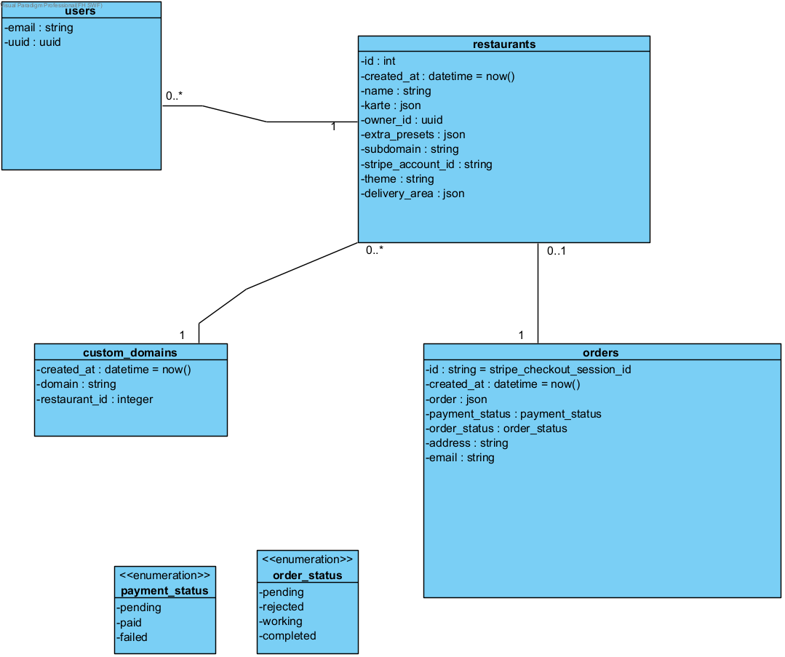

### Row-Level Security

Da wir uns für eine Serverless-Architektur aus Kosten- und Skalierungsgründen, sowie aus Gründen der Einfachheit entschieden haben, haben wir uns für Supabase als Datenbankanbieter entschieden. Supabase bietet eine primitive PostgreSQL-Datenbank mit Row-Level Security an, welche es ermöglicht, die Datenbank auf Zeilenebene zu schützen. Dies bedeutet, dass wir die Datenbank beispielsweise so konfigurieren können, dass ein Gastronom nur auf seine eigenen Restaurants updaten kann, und nicht auf die Restaurants anderer Gastronomen sehen kann. Die Standardpolicy ist hier "Least Privilege", das bedeutet dass niemand operationen ohne explizite Erlaubnis per policy erstellen kann.

Hier sind zwei Beispielpolicies for unsere Orders-Tabelle:

```sql
ALTER TABLE orders ENABLE ROW LEVEL SECURITY;

create policy "Nur Restaurantbesitzer können Bestellungen updaten"
  on orders
  for update using (
    auth.uid() IN (
      SELECT restaurants.owner_id
      FROM restaurants
      WHERE (restaurants.id = orders.restaurand_id)
      -- Mir ist der Tippfehler bewusst; jedoch habe ich zu weit programmiert um ihn zu diesem Zeitpunkt noch zu ändern.
      )
    );

create policy "Jeder kann Bestellungen hinzufügen"
  on orders
  for insert WITH CHECK (
    true
  );
```

Die vollständigen RLS-Policy-Expressions sind im Ordner `doku/policies/policies.sql` zu finden zu finden.

## Beschreibung der zentralen eingesetzten Algorithmen

### Liefergebiet

Um festzustellen ob ein Punkt in einem Polygon liegt, wird der "Point Inclusion in Polygon Test"-Algorithmus verwendet. Dieser ist von W. Randolph Franklin veröffentlicht worden, und wurde integriert um zu prüfen, ob sich die Lieferadresse des Kunden im Liefergebiet des Restaurants befindet.

Siehe dazu https://wrfranklin.org/Research/Short_Notes/pnpoly.html

Diesen hatte ich zu Anfang selbst implementiert, jedoch ist mir bei einem späteren Wechsel von Leaflet.js zu @freenow/react-polygon-editor (das Tool, welches zum interaktiven zeichnen von Polygonen verwendet wird), aufgefallen, dass genau dieser gleiche Algorithmus ebenfalls in diesem Paket verwendet wird. Daher habe ich mich entschieden, meine eigene Implementation zu ersetzen, da der von FreeNow einfach besser zu lesen ist.

### Schemas

Da wir in unserer Datenbank ein JSON-Objekt speichern, müssen wir sehr viel auf Server- und Clientseite validieren.

Dies bedeutet, dass wir JSON-Schemas mit der Library "Zod" erstellen, um die Daten auf Korrektheit zu validieren. Hierfür müssen wir sehr generisch bleiben, da wir nicht wissen, welche Gerichte, Extras, Varianten, etc. der Gastronom anbietet. Daher habe ich Schemas aus Subschemas erstellt, welche erlauben, verschiedene Kompositionen zu erstellen:

```typescript
// Das äußerste Blatt eines JSON-Schemas sind die Extras. Ein Extra hat einen Namen und einen Preis.
export const extra = z.object({
  name: z.string(),
  preis: z.number(),
});

// Ein Extras-Array besteht aus einem Objekt, welches den Namen der Extrakategorie, den Typ (oneOf oder manyOf) und die verfügbaren Extras enthält (items ist ein Array aus "Extra").
export const extras = z.array(
  z.object({
    name: z.string({
      description: "Der Name des der Extrakategorie, z.B. 'Ihr Salatdressing'",
    }),
    typ: z.enum(["oneOf", "manyOf"], {
      description:
        "Der Typ der Extrakategorie, z.B. 'oneOf', wenn nur eine Option ausgewählt werden kann",
    }),
    items: z.array(extra, {
      description: "Die verfügbaren Extras für ein Gericht",
    }),
  })
);

// Ein Preis existiert für Variationen eines Gerichts. Ein Preis hat einen Namen (z.B. "klein", "groß", "normal") und einen Preis.
const preis = z.object({
  name: z.string({
    description:
      "Der Name des Preises, z.B. 'klein (18cm)', 'mittel', 'groß (30cm)'",
  }),
  preis: z.number({
    description:
      "Der Preis in Euro des Gerichts für die angegebene Größe, z.B. 5.5",
  }),
});

// Ein Gericht besteht aus einer ID, einer Überschrift, einer Unterschrift, mindestens einer Preisvariation und optionalen Extras.
export const gericht = z.object({
  id: z.string().or(z.number()),
  ueberschrift: z.string(),
  unterschrift: z.string(),
  preise: z
    .array(preis, {
      description: "Die verfügbaren Größen und Preise für das Gericht",
    })
    .min(1),
  extras: extras.optional(),
});

// Eine Kategorie besteht aus einer Überschrift, einer ID, einem Headerbild und einer Liste von Gerichten.
export const category = z.object({
  headerUrl: z.string().optional(),
  id: z.string().or(z.number()),
  name: z.string(),
  gerichte: z.array(gericht),
});

// Eine Speisekarte besteht aus einer Liste von Kategorien.
export const categories = z.array(category);
```

Diese Struktur erlaubt uns, sehr einfach den Zustand unserer Speisekarte zu verwalten, und die Daten auf Korrektheit zu validieren. Außerdem macht es die Arbeit mit dem Zustandsautomaten des Warenkorbes wesentlich leichter, da diese Struktur uns erlaubt, Autocomplete von VSCode zu verwenden.

### Preise ausrechnen

Hierbei handelt es sich um nichts wirklich komplexes, jedoch ist es wichtig, dass die Preise korrekt berechnet werden. Hierbei handelt es sich um einen einfachen Algorithmus, der die Preise der Variante, und der Extras addiert.

Hier ist es wichtig zu beachten, dass es wie oben beschrieben "ManyOf" und "OneOf"-Extras gibt.

Eine Pizza bietet beispielsweise die Auswahl _einer_ Pizzasoße (z.B. "Tomate" ODER "Hollondaise"), jedoch die Auswahl von _mehreren_ Belägen (z.B. "Käse", "Zwiebeln", "Paprika", etc.).

```typescript
const calcPrice = () => {
  let price =
    gericht.preise.find((preis) => preis.name === variante)?.preis ?? 0;

  // add the price of the extras
  Object.keys(attribute).forEach((key) => {
    const extra = gericht.extras?.find((extra) => extra.name === key);
    if (extra) {
      if (extra.typ === "oneOf") {
        const item = extra.items.find((item) => item.name === attribute[key]);
        if (item) {
          price += item.preis;
        }
      } else {
        // manyOf
        const items = attribute[key] as number[];
        items.forEach((index) => {
          const item = extra.items[index];
          if (item) {
            price += item.preis;
          }
        });
      }
    }
  });

  return price;
};
```

## Geplante Abnahmetests zur Validierung der Anforderungen

Die Abnahmetests werden durchgeführt, um die Funktionalität des Produkts zu überprüfen und sicherzustellen, dass alle Anforderungen erfüllt sind. Sie umfassen unter anderem:

- Testen der Registrierungs- und Login-Funktionen
- Testen der Restaurantverwaltung durch den Gastronomen
  - Hinzufügen von Restaurants
  - Erstellen des Stripe-Subkontos
  - Festlegen des Liefergebietes
  - Hinzufügen einer benutzerdefinierten Domain
  - Hinzufügen einer \*.gastrobit.de-Subdomain
  - Auswahl eines Designs
  - Hinzufügen von Gerichten
  - Testen des Stripe-Dashboards des Subkontos
- Testen des Bestellprozesses und der Bezahlung für den Endkunden
- Testen des Bestellstatus und der Verwaltung der Bestellung durch den Gastronomen

## Geplante Inbetriebnahme auf technischer Ebene

Die Inbetriebnahme umfasst die Installation und Konfiguration des Servers, die Einrichtung der Datenbank und die Bereitstellung der Anwendung im Internet. Wir liefern bereits eine `.env`-Datei mit, welche die Konfiguration für die Datenbank, Stripe, und Vercel enthält. Diese muss lediglich mit den eigenen Daten gefüllt werden, kann jedoch zu Entwicklungszwecken auch weiterhin mit unseren Daten verwendet werden.

### Optionale Anleitung für Self-Hosting

Es werden folgende Accounts benötigt:

- Vercel.com
- Supabase.com
- Stripe.com (verifiziertes Konto)

Außerdem werden Grundkenntnisse in Git benötigt.

#### Vercel.com / AWS

*Vercel.com / AWS bietet eine günstige Plattform, solange man unter den Limits bleibt. Bei unter 200M Requests pro Monat können wir unseren Dienst auf der Serverlessplattform von Vercel konstenlos betreiben. Dies ist ein großer Pluspunkt für uns, da wir so die Kosten für den Betrieb des Dienstes sehr gering halten können. Falls Gastrobit.de kommerziell wird, können wir auch ohne große Probleme horizontal skalieren.*

1. Erstellen Sie ein neues Projekt auf [Vercel.com](https://vercel.com/new)
2. Kopieren Sie alle Projektdateien in eine Git-Repository, und klicken Sie auf vercel.com auf "Import Project", und wählen Sie z.B. von Github.com, Gitlab.com o.ä. ihre Git-Repository aus. Sie können den Namen der Branch durch "GIT_BRANCH_FOR_DOMAINS" definieren, falls Sie eine andere Branch als "main" verwenden möchten.
3. Kopieren Sie "PROJECT_ID_VERCEL", "TEAM_ID_VERCEL" aus den nun angezeigten Projekteinstellungen in die .env-Datei im Root-Verzeichnis dieses Projektes.
4. Erstellen Sie auf [Vercel.com](https://vercel.com/account/tokens) ein neues Token, und kopieren Sie es als "AUTH_BEARER_TOKEN" in die .env-Datei.
5. Nun wird Vercel automatisch nach jedem Git-Commit die Anwendung neu bauen und deployen. Durch das Bearer-Token ist es unserer Anwendung außerdem möglich, die Domains zu verwalten und DNS-Einträge für die Gastronomen zu verwalten.

Wenn Sie statt vercel.com direkt auf AWS hosten wollen, ist das ebenso über die [Vercel-AWS-Extension](https://aws.amazon.com/marketplace/pp/prodview-lwqascgzju3bo) möglich.

#### Supabase.com

*Supabase bietet eine günstige Plattform, solange man unter den Limits bleibt. Bei unter 1GB DB-Gräße können wir unseren Dienst auf der Postgresql-Datanbank von Supabase konstenlos betreiben. Dies ist ein großer Pluspunkt für uns, da wir so die Kosten für den Betrieb des Dienstes sehr gering halten können. Falls Gastrobit.de kommerziell wird, können wir auch ohne große Probleme mit Read-Replicas skalieren; da die meisten Operationen auf unsere Datenbank reads sind.*

1. Erstellen Sie ein neues Projekt auf [Supabase.com](https://app.supabase.io/)
2. Wählen Sie eine Region aus, die zu ihren Endnutzern physisch nah ist und aus Datenschutzsicht sinnvoll ist, z.B. Frankfurt in Deutschland.
3. Navigieren Sie zu den [Projekteinstellungen](https://supabase.com/dashboard/project/<project-id>/settings/api) und kopieren Sie folgende Daten in Ihre .env-Datei:
   1. Die Projekt-URL als `NEXT_PUBLIC_SUPABASE_URL`
   2. Anon-Key als `NEXT_PUBLIC_SUPABASE_ANON_KEY`
   3. Service-Role/Secret-Key als `SUPABASE_SERVICE_KEY`
   4. Falls Sie unser Produkt selbst weiterentwickeln möchten, können Sie in Supabase ein eigenes Access-Token definieren. Dies erlaubt es Typen aus der Datenbank zu exportieren. Wir liefern dafür das script `npm run types` mit, welches automatisch die neusten Typedefinitionen aus der Datenbank kopiert. Dies macht die Entwicklung sehr viel leichter. Das Access-Token muss als `SUPABASE_ACCESS_TOKEN` in der .env-Datei definiert werden.
4. Für das Erstellen des Datenbankschemas gibt es zwei Möglichkeiten:
   1. Verwenden Sie das Tool `pg_restore -h db.<project-id>.supabase.co -U postgres -W -d <database-name> -1 -v "POSTGRES_BACKUP"`, um die Tabellen zu erstellen. (Empfohlen, und wesentlich weniger Arbeit). Die Datei `POSTGRES_BACKUP` finden Sie im Ordner über dem Projekt.
   2. Erstellen Sie eine neue Datenbank, und führen das Tabellenscript von Hand aus
      1. Installieren Sie die postgresql-SQL-Shell, z.B. mit `sudo apt install postgresql-client`, oder nutzen Sie ein Cross-Platform-Tool für die GUI wie z.B. [pgAdmin](https://www.pgadmin.org/).
      2. Kopieren Sie den Benutzernamen und das Passwort des Supabase-Admins, und loggen Sie sich mit `psql -h db.<project-id>.supabase.co -U postgres -W` ein. _Achten Sie hier auf die Domainendung `.co` und nicht `.com`._
      3. Führen Sie die SQL-Statements aus `pg_dump.sql` aus, um die Tabellen zu erstellen.
5. Richten Sie den S3-Storage auf https://supabase.com/dashboard/project/cdnbppscedvrlglygkyn/storage/buckets ein. Erstellen Sie hierfür einen neuen Bucket, nennen Sie ihn "restaurant_assets" und richten Sie die folgenden Policies ein:
   1. Name: `Allow everyone to download and list assets`
      - `SELECT` `default`: USING `(bucket_id = 'restaurant_assets'::text)`
   2. Name: `Only allow authed users to update their own assets`
      - `UPDATE` `authenticated`: USING `((bucket_id = 'restaurant_assets'::text) AND ((auth.uid())::text = (storage.foldername(name))[1]))`
   3. Name: `Only allow authed users to insert`
      - `INSERT` `authenticated`: USING `((bucket_id = 'restaurant_assets'::text) AND ((auth.uid())::text = (storage.foldername(name))[1]))`
   4. Name: `Only allow authed users to delete their own assets`
      - `DELETE` `authenticated`: USING `((bucket_id = 'restaurant_assets'::text) AND ((auth.uid())::text = (storage.foldername(name))[1]))`
6. Setzen die den Bucket als "Public", und stellen Sie ein Uploadlimit ein, welches für die Headerbilder von Kategorien auf der Speisekarte sinnvoll ist. Wir empfehlen 8MB.
7. Erlauben Sie nur Bilderuploads durch das setzen der folgenden MIME-Typen: `image/jpg, image/jpeg, image/png, image/webp`.

#### Stripe.com

*Stripe ist ein Zahlungsanbieter, der es uns ermöglicht, Zahlungen von Endkunden zu akzeptieren, und diese an die Gastronomen weiterzuleiten. Stripe bietet eine sehr gute Dokumentation, und ist sehr einfach zu verwenden. Außerdem ist Stripe sehr günstig und bietet das Stripe-Dashboard für unsere Gastronomen an, welche darauf ihre Umsätze anschauen können.*

1. Erstellen Sie ein neues Projekt auf [Stripe.com](https://stripe.com/)
2. Verifizieren Sie ihr Konto, indem Sie die notwendigen Dokumente hochladen, oder verwenden Sie den Testmodus ohne Verifizierung (dies ist für den Produktivbetrieb nicht empfohlen, jedoch sinnvoll in einer Testumgebung).
3. Melden Sie dich für [Stripe-Connect](https://dashboard.stripe.com/connect/accounts/overview) an.
4. Navigieren Sie zu den [Entwickler-Einstellungen](https://dashboard.stripe.com/apikeys) und kopieren Sie den "Geheimschlüssel als " als `STRIPE_SECRET_KEY` in die .env-Datei
5. Navigieren Sie zu den [Webhooks](https://dashboard.stripe.com/webhooks) und erstellen Sie einen neuen Webhook mit der URL `https://<domain>/api/stripe/webhook`. Wählen Sie als "Event-Typen" alles mit dem Präfix "checkout.session.\*" aus. Kopieren Sie den "Signing Secret" als `STRIPE_WEBHOOK_SECRET` in die .env-Datei.
6. Legen Sie die URL fest, zu welcher navigiert werden soll, wenn ein Gastronom fertig mit der Erstellung seines Stripe-Subkontos ist. Tragen Sie diese als `STRIPE_RETURN_URL` und `STRIPE_REFRESH_URL` in die .env-Datei ein.

#### Root-URL

Tragen Sie ihre Root-URL als `NEXT_PUBLIC_ROOT_URL` in die .env-Datei ein. Diese wird für die Generierung von Links verwendet, z.B. für die Bestellbestätigung, oder für die Weiterleitung nach dem Checkout. Tragen Sie außerdem für eine Produktiventwicklung die Umgebungsvariable `env` als `production` ein, damit weniger geloggt wird.

#### Node.js

Nachdem wir erfolgreich die Secrets und Drittdienste konfiguriert haben, können wir nun die Anwendung starten. Hierfür benötigen wir Node.js. Installieren Sie Node.js, z.B. mit `sudo apt install nodejs`, installieren Sie die abhänigkeiten mit `npm ci` in dem Verzeichnis, wo die `package.json` liegt, und führen Sie die Anwendung mit `npm run dev` aus. Die Anwendung ist nun unter `http://localhost:3000` erreichbar.

Um einen Build für die Produktion zu erstellen, führen Sie `npm run build` und `npm start` aus.

## Einführung der Nutzung des Produkts durch den Endnutzer

### Registrierung und Login

**Zu Demonstrationszwecken können Sie sich mit dem Testaccount `test@wertfrei.org` und dem Passwort `test123456` einloggen.**

#### Registrierung

1. Navigieren Sie zu https://www.gastrobit.de/login und klicken Sie auf "Hast du noch kein Konto? Registrieren".
2. Geben Sie ihre gewünschte Email-Adresse und ein Passwort ein, und klicken Sie auf "Registrieren".
3. Sie bekommen nun eine E-Mail mit einem verifizierungslink. Klicken Sie auf diesen Link.

#### Login

1. Navigieren Sie zu https://www.gastrobit.de/login und geben Sie ihre E-Mail-Adresse und ihr Passwort ein.
2. Drücken Sie auf Login.

Falls Sie ihr Passwort vergessen haben, können Sie auf "Passwort vergessen" klicken, und Sie bekommen eine E-Mail mit einem Link zum zurücksetzen des Passworts. Oder Sie loggen sich mit der Hilfe eines magischen Links ein.

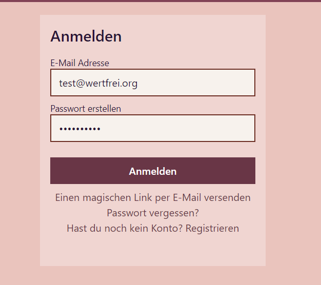

### Restaurantübersicht

Nachdem Sie sich eingeloggt haben, werden Sie auf die Restaurantübersicht weitergeleitet. Hier können Sie Restaurants hinzufügen, oder bereits erstellte Restaurants verwalten.

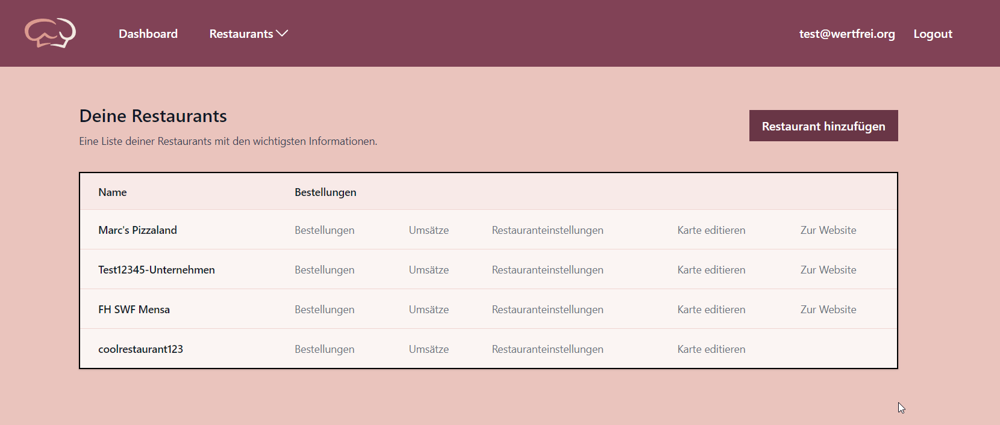

1. Vermutlich haben Sie noch keines erstellt, also klicken Sie auf den Button "Restaurant hinzufügen".
2. Geben Sie den Namen des Restaurantes ein und wählen Sie ob Sie ein Unternehmen, ein Individuum oder eine Non-Profit sind, und klicken Sie auf "Restaurant erstellen".
3. Anschließend werden Sie zu unserem Zahlungsdienstleister weitergeleitet. Bitte folgen Sie den Instruktionen auf dem Bildschirm, und antworten Sie wahrheitsgemäß.
4. Im Anschluss werden Sie wieder zurück zur Restaurantübersicht weitergeleitet und ihr neues Restaurant wird angezeigt.

```
Im Testmodus für Entwickler können Sie Testdaten verwenden, um den Prozess zu beschleunigen:
Mobilnummer: +49 00000000
2FA Code: 000000
Vorname: Max
Nachname: Mustermann
E-Mail: test@stripe.com
Geburtsdatum: 01.01.1990
Privatadresse: Musterstraße 1, 58644 Musterstadt

Branche: Restaurants
Produktbeschreibung: Pizza-Lieferservice

Währung: Euro

IBAN: DE89370400440532013000
```

### Restaurantverwaltung

Ihr neues Restaurant ist noch nicht besuchbar. **Um das zu ändern, klicken Sie in der Restaurantübersicht auf "Restauranteinstellungen".**

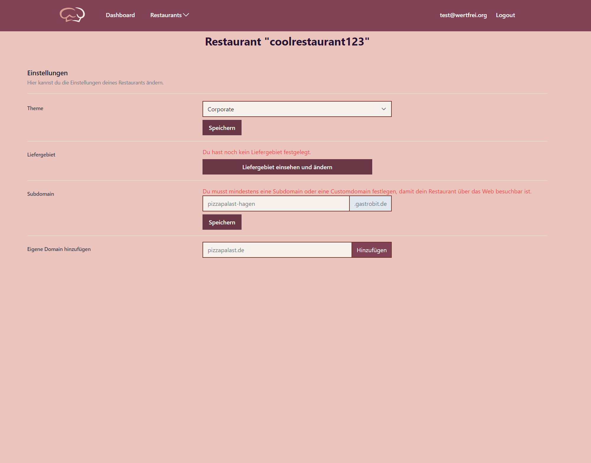

In den Restauranteinstellungen können Sie folgende Dinge einstellen:

- eines von 21 Designs auswählen. (Die Designs sind von daisyui.com und sind unter der MIT-Lizenz veröffentlicht).
- eine Subdomain festlegen.
- eigene Domains hinzufügen.
- das Liefergebiet festlegen.

#### Theme

Das Theme auswählen ist sehr einfach. Klicken Sie auf ein Theme im Dropdown und klicken Sie auf "Speichern". Das Theme wird sofort angewendet. Sie müssen jedoch erst eine Subdomain oder eine eigene Domain festlegen, und eine Speisekarte erstellen, um das Theme in voller pracht zu sehen. Es ist sinnvoll, diese Option später neu zu besuchen, sobald wir die wichtigsten Dinge des Restaurants konfiguriert haben.

#### Subdomain

Hier können Sie eine Subdomain festlegen, unter der ihr Restaurant erreichbar ist. Geben Sie einen Namen ein, und klicken Sie auf "Speichern". Sie können nun ihr Restaurant unter `<subdomain>.gastrobit.de` erreichen. Sie müssen jedoch erst eine Speisekarte erstellen, um das Restaurant zu besuchen.

#### Eigene Domains

Falls Sie eine eigene Domain besitzen, z.B. "marcs-pizzarestaurant-iserlohn.de", können Sie diese hier hinzufügen. Tragen Sie die Domain in das Feld ein und drücken Sie auf "Domain hinzufügen".

Nach wenigen Sekunden bekommen Sie ein neues Element auf Ihrem Bildschirm angezeigt, welches Ihnen sagt, dass Sie einen DNS-Eintrag hinzufügen müssen. Dieser Eintrag ist notwendig, damit wir ihre Domain mit unserem System verbinden können. Sie können hier zwischen "A-Record" und "CName-Record" wählen.

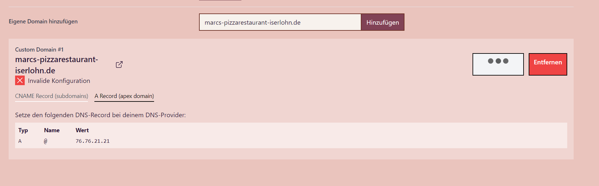

**Falls Sie nicht wissen, welchen Eintrag Sie hinzufügen müssen, kontaktieren Sie bitte ihren Domain-Provider.**

Nachdem Sie den Eintrag hinzugefügt haben wird nach wenigen Sekunden ihre Domain als "Verifiziert" angezeigt. Sie können nun ihr Restaurant unter `<domain>` erreichen. Sie müssen jedoch erst eine Speisekarte erstellen, um das Restaurant zu besuchen.

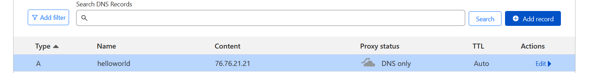

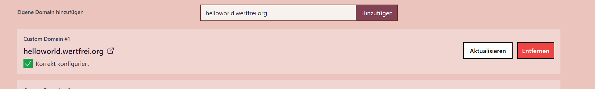

#### Liefergebiet

Um ein Liefergebiet festzulegen, folgen Sie diesen Instruktionen:

1. Klicken Sie auf den Button "Liefergebiet einsehen und festlegen".
2. Sie werden aufgefordert Ihren Standort zu teilen. Lesen Sie die Meldung durch, verstehen Sie sie, und klicken Sie ggf. auf "Erlauben".

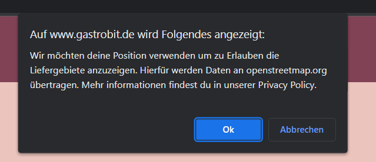

3. Sie werden nun auf eine Karte weitergeleitet, auf der Sie ihr Liefergebiet festlegen können. Benutzen Sie dafür das "Pen"-Werkzeug, um neue Punkte auf der Karte einzutragen. Sie können auch bereits bestehende Punkte per Drag-and-Drop verschieben. Wenn Sie einen Punkt löschen wollen, klicken Sie den Punkt an und anschließend auf "Delete".
4. Klicken Sie auf "Speichern", wenn Sie fertig sind.

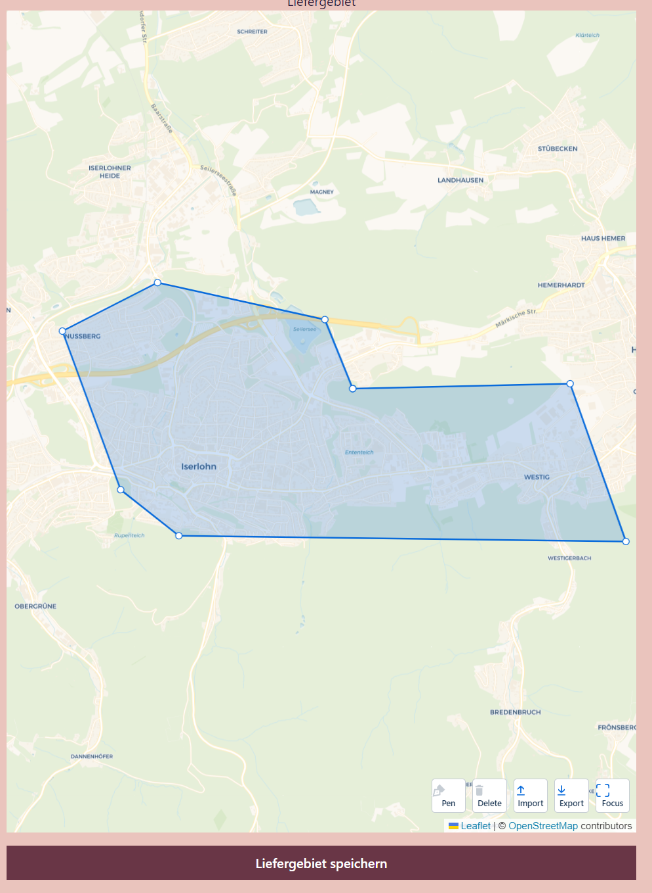

### Speisekarte

Um eine Speisekarte zu erstellen, klicken Sie auf "Karte editieren" in der Restaurantübersicht. Anschließend landen Sie bei der Speisekartenverwaltung, mit ein paar Beispielen, die Sie löschen können.

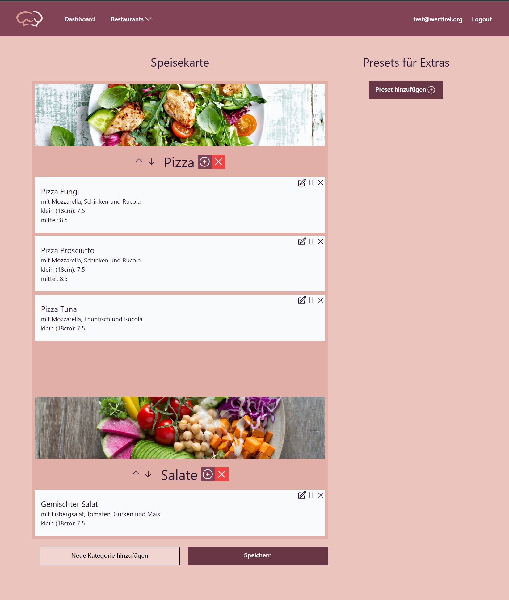

#### Presets für Extras

Ein Extra ist auf Extra-Attribut zu einem Gericht. Dies kann bei einer Pizza beispielsweise "Käse", "Zwiebeln", "Paprika", etc. sein. Sie können hierfür Presets erstellen, um die Arbeit zu erleichtern.

Es gibt zwei Arten von Extras: **Einzelauswahl** und **Mehrfachauswahl**.

Einzelauswahl bedeutet, dass der Kunde nur eine Option auswählen kann, wie z.B. die Soße bei einer Pizza (man wählt zwischen Tomatensoße oder Hollondaise). Wenn eine Auswahl getroffen werden muss, kann es hier sinnvoll sein, den Preis für die Auswahl auf "0"€ zu setzen.

Klicken Sie auf "Extra hinzufügen" um eine neue Zeile hinzuzufügen, oder auf das Kreuz um eine Zeile zu löschen. Drücken Sie auf "Hinzufügen", um das Preset fertigzustellen.

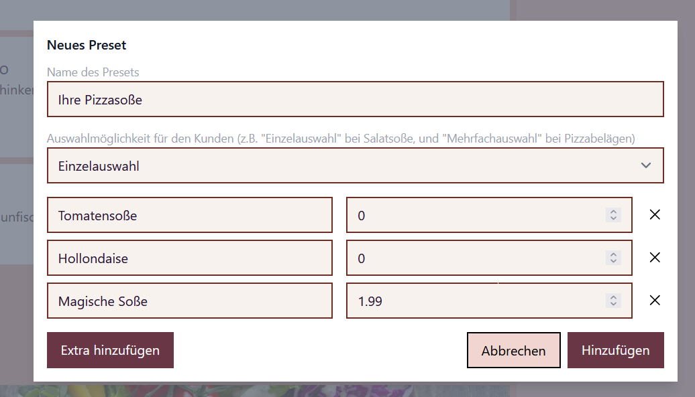

Mehrfachauswahl bedeutet, dass der Kunde mehrere Optionen auswählen kann, z.B. kann der Kunde mehrere Extras wie Käse, Zwiebeln, Paprika etc. auswählen.

Das ganze funktioniert genau wie die Einzelauswahl:

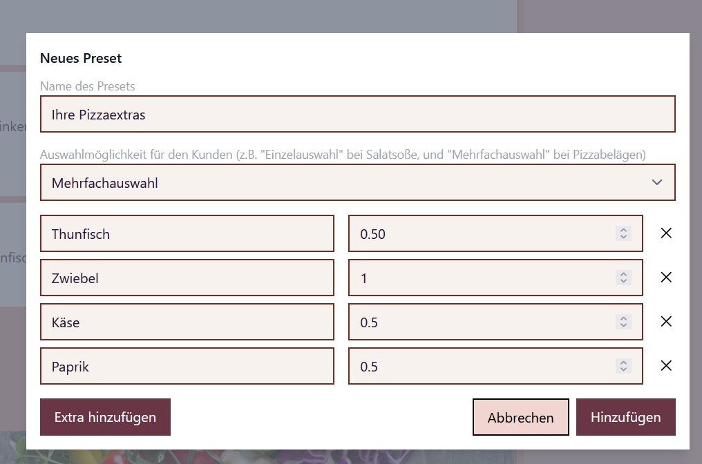

**Bitte beachten Sie die Daten zu speichern durch das klicken auf "Speichern" am unteren Ende der Seite.**

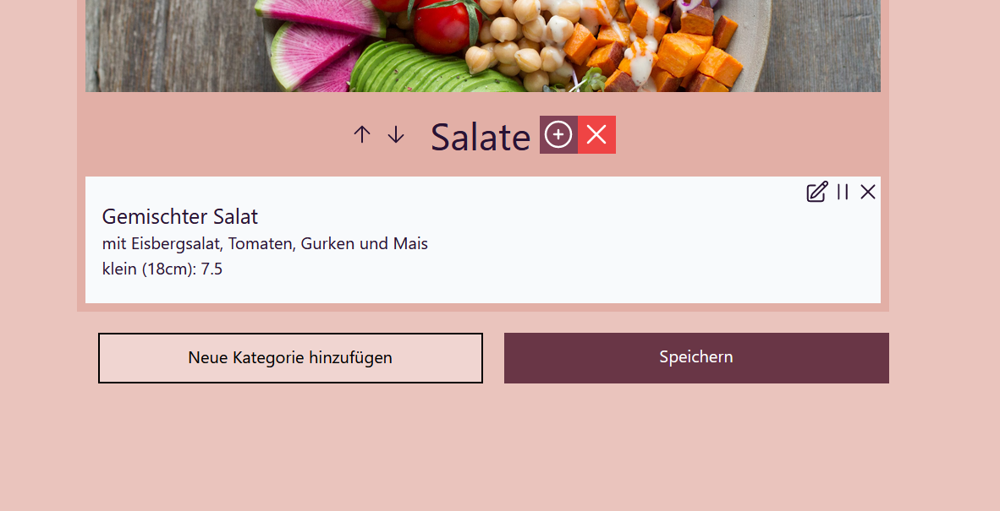

#### Kategorien

Sie können eine Kategorie einfach durch das drücken auf "Neue Kategorie hinzufügen" am unteren Ende der Seite anklicken. Sie werden darauf aufgefordert, einen Namen für die Kategorie festzulegen.

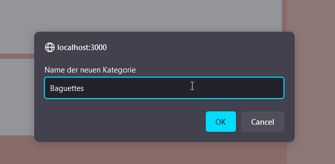

Anschließend können Sie einen neuen Banner per Drag-and-Drop auf den Platzhalter, oder durch Anklicken setzen.

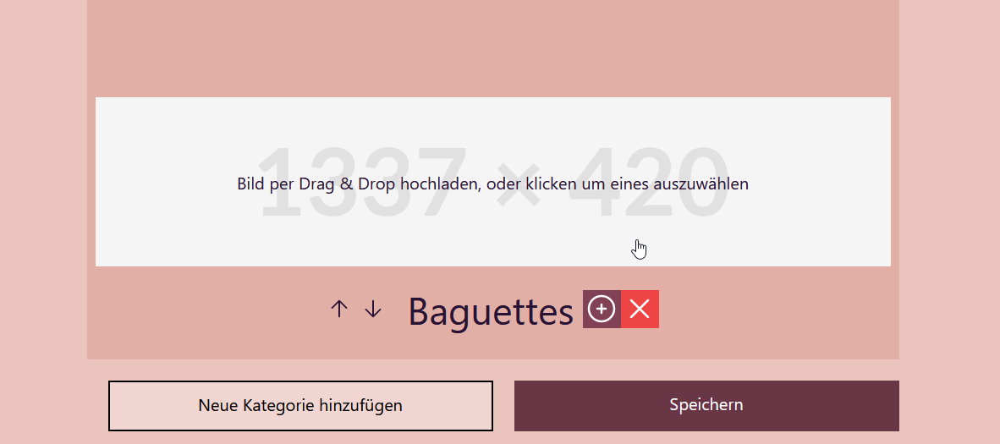

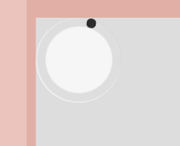

Sie können die Kategorie durch Klicken auf den Namen wieder umbenennen, oder durch das Klicken auf das Kreuz löschen.

Die Pfeile erlauben es Ihnen, die Reihenfolge der Kategorien zu ändern.

Das Kreuz neben dem Namen der Kategorie erlaubt es Ihnen, die Kategorie zu löschen.

**Bitte klicken Sie auf "Speichern", um die Änderungen zu speichern.**

#### Gerichte

Fügen Sie ein neues Gericht zu einer Kategorie hinzu, indem Sie auf das Plussymbol klicken.

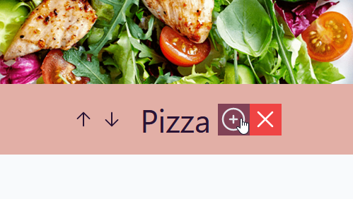

Anschließend können Sie das neuhinzugefügte Gericht bearbeiten, indem Sie auf den Strift oben rechts in der Ecke klicken. _Übrigens, mit den zwei Strichen daneben können Sie das Gericht in der Reihenfolge der Kategorie verschieben. Einfach draufklicken, die Maustaste gedrückt halten, und das Gericht an die gewünschte Stelle ziehen. Das Kreuz daneben löscht logischerweise das Gericht._

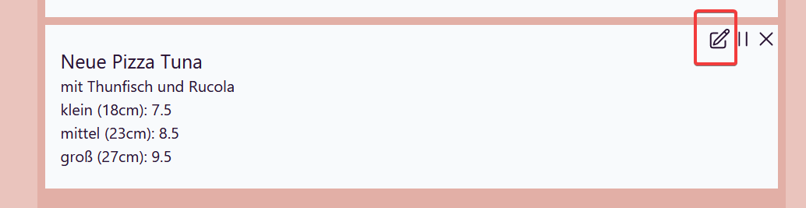

Anschließend kommt das folgende Menü zum Vorschein:

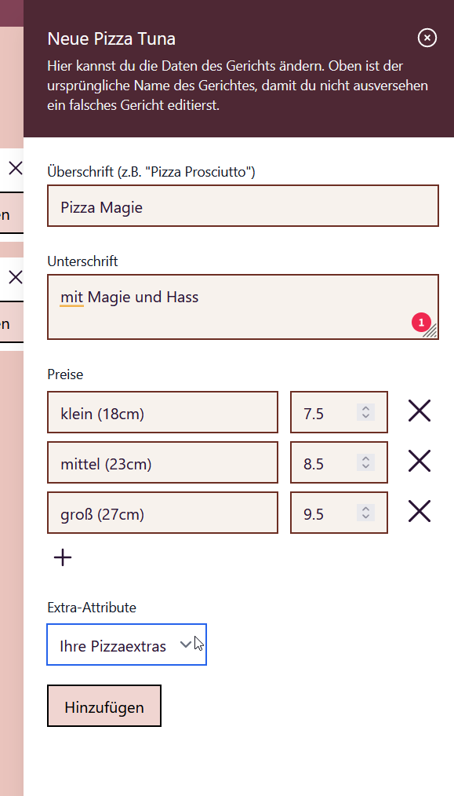

Sie können die Überschrift und Unterschrift hier bearbeiten.

Hier können Sie Preise für verschiedene Varianten des Gerichtes (z.B. Groß, Mittel, Klein bei Pizzen) festlegen. Wenn es nur eine Variante gibt, ist es ratsam, die Variante einfach "Standard" zu nennen, und die restlichen Varianten zu löschen.

Außerdem können Sie hier die Extra-Attribute aus ihren Presets hinzufügen. Einfach in der Combobox auswählen und auf "Hinzufügen" drücken. Sie können die Extras auch wieder löschen, indem Sie auf das Kreuz neben dem Namen des Extras klicken.

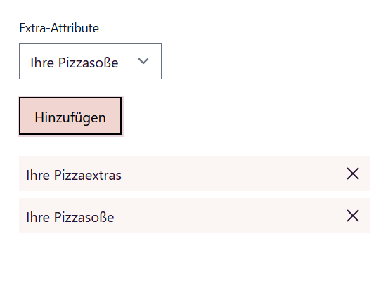

Wenn Sie fertig sind, klicken Sie auf "Ändern", und anschließend auf "Speichern" am Ende der Seite.

### Bestellen

#### Gerichtsauswahl

Gehen Sie auf die Seite Ihres eingerichteten Restaurants. Benutzen Sie dafür Ihre Custom-Domain oder eine Subdomain. Wir haben eine Demoseite auf https://marcpizzaland.gastrobit.de/ vorbereitet.

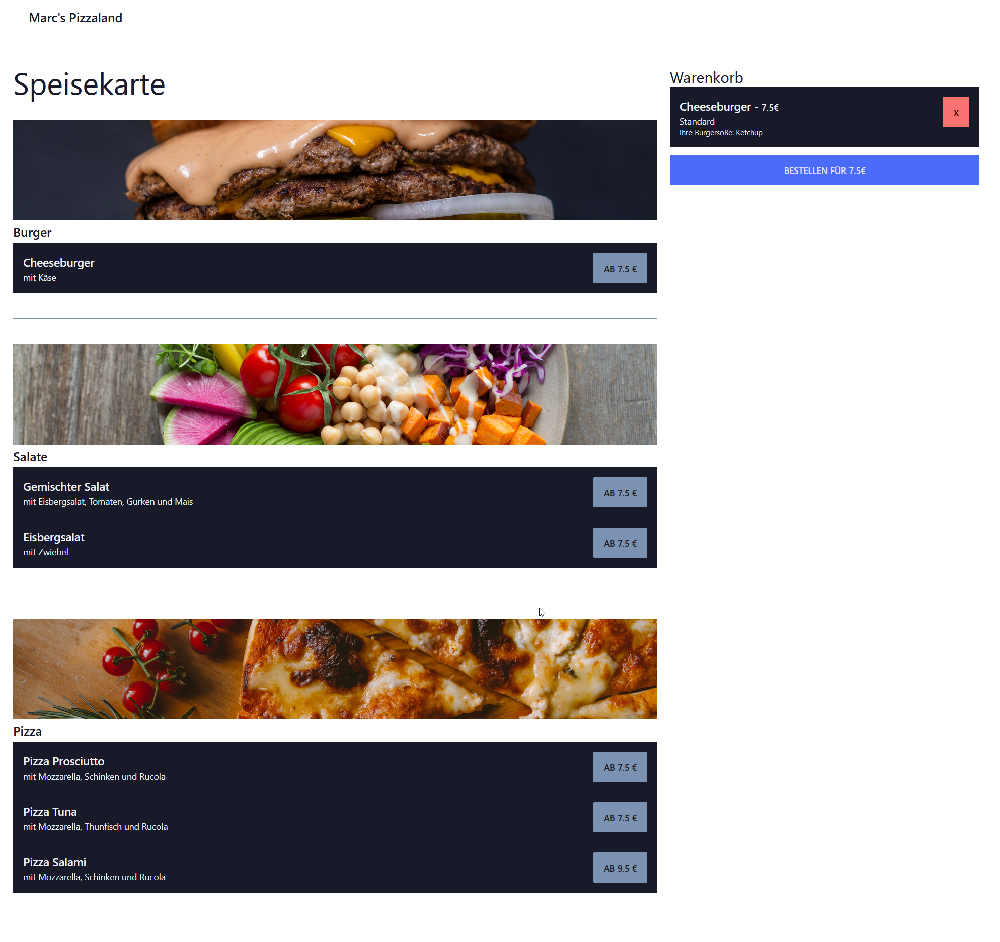

Die Bedienung ist selbsterklärend, schließlich sollen Ihre Kunden sich auch zurechtfinden. Sie können Gerichte in den Warenkorb legen, Extras auswählen (sofern konfiguriert), und anschließend auf "Bestellen für X€" klicken. Der Preis auf dem Button aktualisiert automatisch.

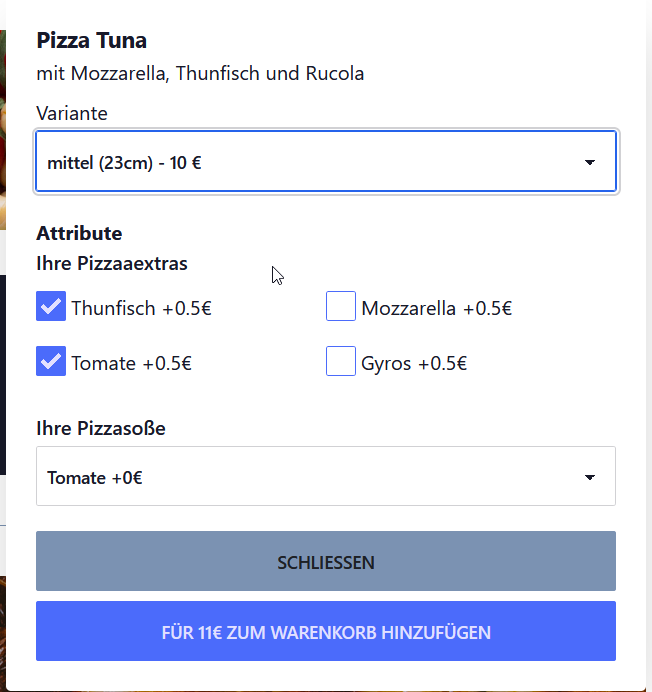

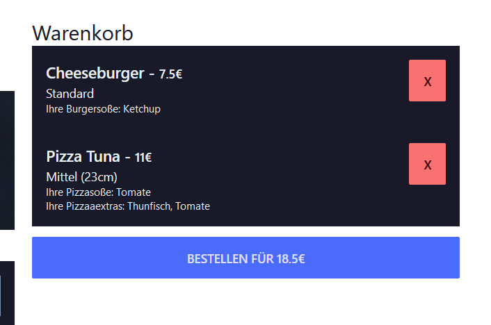

##### Lieferadresse

Die nun anzugebende Lieferadresse muss im vorher definierten Liefergebietpolygon liegen. Für den sogenannten "Lookup" von der Adresse verwenden wir OpenStreetMap. Dies ist ein freies Projekt, welches von Freiwilligen gepflegt wird. Es ist daher wichtig in der Datenschutzerklärung darauf hinzuweisen, dass die Daten an OpenStreetMap übertragen werden. Die Einwilligung muss dafür erteilt werden, weshalb wir auf die Checkbox nicht verzichten dürfen.

 Außerdem ist es wichtig, dass die Daten nicht für andere Zwecke verwendet werden dürfen, als für die Bestellung. Dies ist ebenfalls in der Datenschutzerklärung zu erwähnen. Wir übernehmen das für Sie.

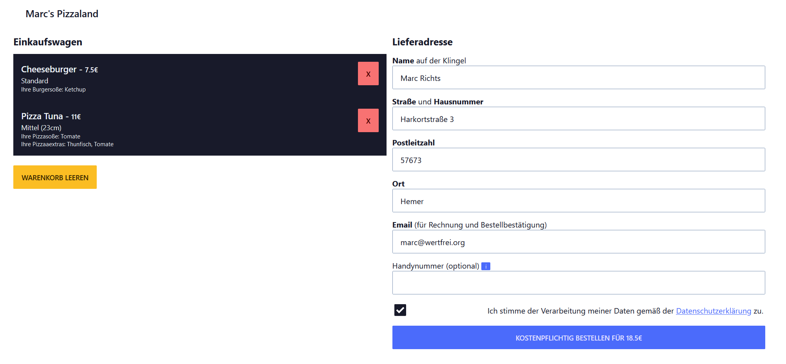

Sollte die Adresse nicht im Liefergebiet liegen, bekommt der Nutzer einen Hinweis darauf.

Anschließend wird der Nutzer zur Zahlungsseite weitergeleitet.

Hier können Sie, falls Sie Stripe im Demomodus verwenden, folgende Testdaten verwenden:

```
Kartennummer: 4242 4242 4242 4242
Ablaufdatum: Ein Datum in der Zukunft
CVC: Drei Ziffern Ihrer Wahl
Name: Ein Name Ihrer Wahl
Land: Ein Wunschland
```

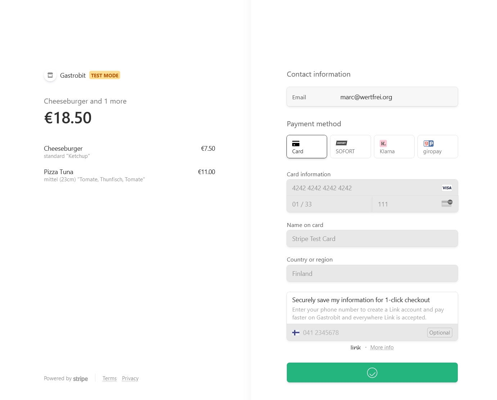


### Bestellungen abarbeiten

In der Restaurantübersicht können Sie auf "Bestellungen" klicken, um die Bestellungen zu verwalten.

**Diese Ansicht ist *Live***. Das bedeutet, dass sobald eine neue Bestellung eingeht, diese Seite automatisch aktualisiert wird. Dies wird mit Websockets realisiert, und ist sehr performant. Sie können die Seite also einfach offen lassen, und Sie werden benachrichtigt, sobald eine neue Bestellung eingeht.

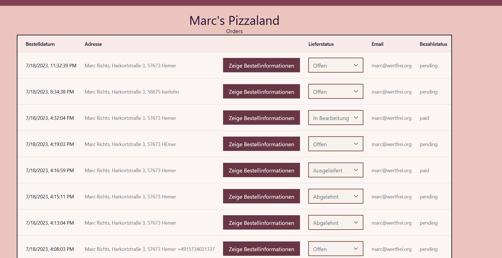

Wenn Sie auf "Zeige Bestellinformationen" klicken, bekommen Sie die Orderdetails angezeigt:

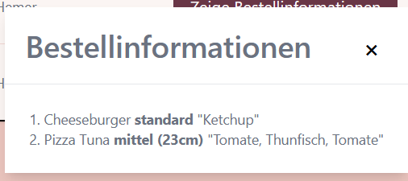

Hier können Sie außerdem den Lieferstatus verändern, und einsehen, ob die Lieferung bereits bezahlt wurde. Mit den meisten Zahlungsmöglichkeiten wie Kreditkarte geht das innerhalb weniger Sekunden. Wir empfehlen, keine Bestellungen zu bearbeiten, bevor die Zahlung nicht abgeschlossen ist.

*An dieser Stelle hatten wir die Designentscheidung getroffen, auch nicht-bezahlte Bestellungen anzuzeigen, einfach aus dem Grund, dass wir der Meinung sind, dass die Daten dem Gastronomen gehören, und er die Verantwortung dafür übernehmen soll.*

### Lieferstatus

Der Lieferstatus kann folgende Werte annehmen:
- Offen
- In Bearbeitung
- Ausgeliefert
- Abgelehnt

Die ersten drei Status dienen nur der Verwaltung und Übersicht für Sie. Abgelehnt bedeutet jedoch, dass Sie die Bestellung nicht ausliefern können (z.B. weil Sie bereits so viel zu tun haben, oder nicht genug Zutanten haben). Sollten Sie diese Option auswählen, wird ein automatischer Refund an den Kunden getriggert, und Sie zahlen 35 Cent Gebühren an Stripe (sofern Sie auf Stripe wirklich Live sind, und nicht den Testmodus verwenden).

---

## Quellen

Falls Sie weitere Fragen haben, kontaktieren Sie unseren Support unter richts.marc-alexander@fh-swf.de.

Quellen und verwendete Libraries, sofern nicht anders markiert:
```
    "@dnd-kit/core": "^6.0.8",
    "@dnd-kit/modifiers": "^6.0.1",
    "@dnd-kit/sortable": "^7.0.2",
    "@freenow/react-polygon-editor": "^2.0.1",
    "@headlessui/react": "^1.7.13",
    "@heroicons/react": "^2.0.17",
    "@prisma/client": "^4.12.0",
    "@supabase/auth-helpers-nextjs": "^0.6.1",
    "@supabase/auth-helpers-react": "^0.3.1",
    "@supabase/auth-ui-react": "^0.3.5",
    "@supabase/auth-ui-shared": "^0.1.3",
    "@supabase/supabase-js": "^2.15.0",
    "@types/node": "18.15.11",
    "@types/react": "18.0.31",
    "@types/react-dom": "18.0.11",
    "daisyui": "^3.1.0",
    "eslint": "8.37.0",
    "leaflet": "^1.9.4",
    "lodash-es": "^4.17.21",
    "micro-cors": "^0.1.1",
    "next": "^13.4.1",
    "node-uuid": "^1.4.8",
    "nominatim-browser": "^2.1.0",
    "nominatim-client": "^3.2.1",
    "querystring": "^0.2.1",
    "react": "^18.2.0",
    "react-dom": "^18.2.0",
    "react-dropzone": "^14.2.3",
    "react-geolocated": "^4.1.1",
    "react-hook-form": "^7.43.9",
    "react-hot-toast": "^2.4.1",
    "react-leaflet": "^4.2.1",
    "react-spinners": "^0.13.8",
    "redux": "^4.2.1",
    "stripe": "^11.18.0",
    "styled-components": "^6.0.4",
    "swr": "^2.1.5",
    "typescript": "5.0.3",
    "zod": "^3.21.4",
    "zustand": "^4.3.8"
    "@tailwindcss/aspect-ratio": "^0.4.2",
    "@tailwindcss/forms": "^0.5.3",
    "@types/leaflet": "^1.9.3",
    "@types/lodash-es": "^4.17.8",
    "@types/lodash.isequal": "^4.5.6",
    "@types/micro-cors": "^0.1.3",
    "autoprefixer": "^10.4.14",
    "eslint-config-next": "^13.4.1",
    "postcss": "^8.4.21",
    "supabase": "^1.50.2",
    "tailwindcss": "^3.3.1"
```

Bilder für die Präsentation wurden von [Unsplash](https://unsplash.com/) bezogen. Es gilt die Lizenz dass die Bilder nichtkommerziell frei verwendet werden dürfen. Mehr Informationen dazu unter [https://unsplash.com/license](https://unsplash.com/license).

