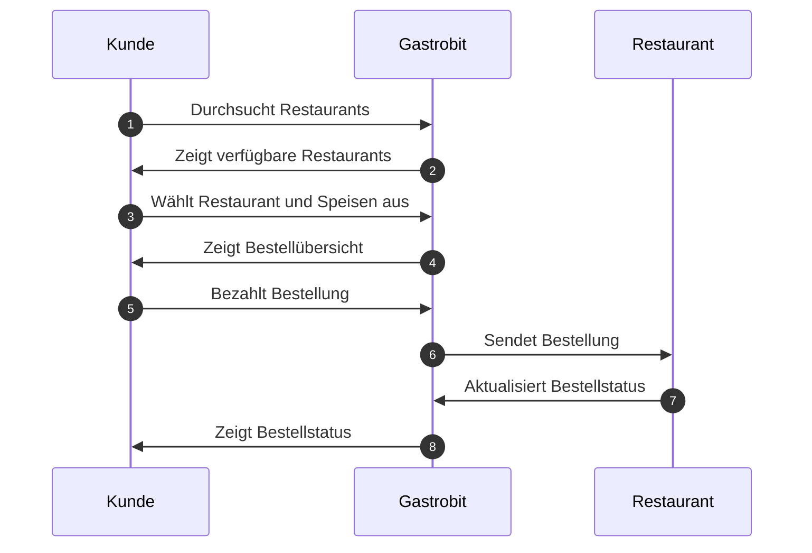

# Projekt - SS2023 - Gastrobit.de

| Name                  | Matrikelnummer | E-Mail                          |
| --------------------- | -------------- | ------------------------------- |
| Marc-Alexander Richts | 10059445       | richts.marc-alexander@fh-swf.de |

# Ausarbeitung: Entwicklung einer Alternative zu Lieferando

## 1. Ermittlung der Anforderungsaufnahme

Die Anforderungen für unsere Alternative zu Lieferando wurden durch eine Kombination aus Marktforschung und Benutzerinterviews ermittelt. Die Hauptanforderungen sind:

- Benutzerfreundliche Oberfläche
- Responsive Design für mobile Endgeräte beim Kaufvorgang durch Endkunden
- Einfache Bestellprozesse für den Endkunden
- Registrierung und Login für Gastronomen
- Integration von Zahlungsmethoden über Stripe
- Restaurantverwaltung durch den Besitzer (z.B. Speisekarte, Erreichbarkeit über eigene Domain, Themeauswahl, Festlegung des Liefergebietes etc.)
- Tracking und Verwaltung des Bestellvorgangs

## 2. Identifikation der Anwendungsfälle des Softwareprodukts

Die Anwendungsfälle für unser Produkt wurden identifiziert und in einem Use Case Diagramm dargestellt. Die Hauptanwendungsfälle sind:

- Registrierung und Login für Endkunden und Gastronomen
- Hinzufügen und Verwalten von Restaurants durch den Gastronomen
- Übersicht über Umsätze von Restaurants
- Ändern von Gerichten auf der Speisekarte durch den Gastronomen (Extras (z.B. Käse, Zwiebeln, etc.), Preise, Varianten (groß, mittel, klein), kategorisieren, etc.)
- Speisekarten
- Bestellung von Speisen und Getränken
- Bezahlung der Bestellung
- Verfolgung des Bestellstatus
- Verwaltung von Restaurantinformationen durch den Gastronomen

## 3. Entwurf einer Benutzungsoberfläche für das Produkt

Die Benutzungsoberfläche wurde mit Wireframes entworfen, um eine benutzerfreundliche und intuitive Navigation zu gewährleisten. Die Hauptelemente der Benutzungsoberfläche sind:

- Startseite mit Suchfunktion für Restaurants
- Restaurantseite mit Speisekarte und Bestellfunktion
- Warenkorbseite mit Übersicht der ausgewählten Speisen und Getränke und Bezahlmöglichkeit
- Profilseite für Endkunden und Gastronomen mit entsprechenden Verwaltungsfunktionen

## 4. Herleitung eines Datenmodells

Das Datenmodell wurde auf Basis der identifizierten Anforderungen und Anwendungsfälle erstellt. Es besteht aus folgenden Hauptentitäten:

- Benutzer (Endkunden und Gastronomen)
- Restaurants
- Speisen und Getränke
- Bestellungen

## 5. Beschreibung der zentralen eingesetzten Algorithmen

Die zentralen Algorithmen umfassen die Suchfunktion für Restaurants, die Bestellabwicklung und die Aktualisierung des Bestellstatus.

## 6. Geplante Abnahmetests zur Validierung der Anforderungen

Die Abnahmetests werden durchgeführt, um die korrekte Funktionalität des Produkts zu überprüfen und sicherzustellen, dass alle Anforderungen erfüllt sind. Sie umfassen unter anderem:

- Testen der Registrierungs- und Login-Funktionen
- Testen der Suchfunktion für Restaurants
- Testen des Bestellprozesses und der Bezahlung
- Testen der Restaurantverwaltung durch den Gastronomen

## 7. Geplante Inbetriebnahme auf technischer Ebene

Die Inbetriebnahme umfasst die Installation und Konfiguration des Servers, die Einrichtung der Datenbank und die Bereitstellung der Anwendung im Internet.

## 8. Einführung der Nutzung des Produkts durch den Endnutzer

Die Einführung der Nutzung des Produkts durch den Endnutzer umfasst die Erstellung von Benutzerhandbüchern und Schulungsunterlagen sowie die Durchführung von Schulungen für Gastronomen.

https://gastrobit.de/api/stripe/webhook

https://dashboard.stripe.com/test/webhooks/create?endpoint_location

