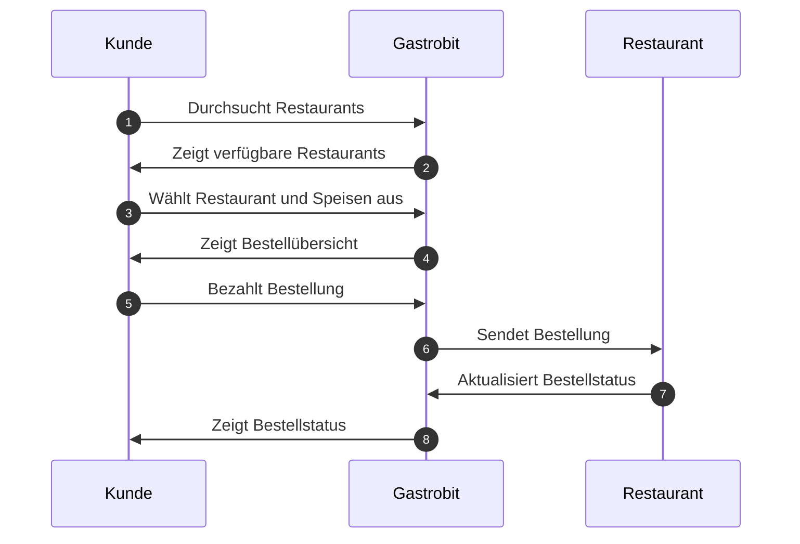

# Projekt - SS2023 - Gastrobit.de

| Name                  | Matrikelnummer | E-Mail                          |
| --------------------- | -------------- | ------------------------------- |
| Marc-Alexander Richts | 10059445       | richts.marc-alexander@fh-swf.de |

# Ausarbeitung: Entwicklung einer Alternative zu Lieferando

## 1. Ermittlung der Anforderungsaufnahme

Die Anforderungen für unsere Alternative zu Lieferando wurden durch eine Kombination aus Marktforschung und einem Gastronomeninterview ermittelt. Die Hauptanforderungen sind:

- Benutzerfreundliche Oberfläche für den ENdkunden
- Responsive Design für mobile Endgeräte beim Kaufvorgang durch Endkunden
- Einfache Bestellprozesse für den Endkunden
- Bezahlungsfunktion für den Endkunden
- Restaurantverwaltung durch den Besitzer (Speisekarte, Erreichbarkeit über eigene Domain/\*.gastrobit.de-Subdomain, Auswahl eines Designs, Festlegung des Liefergebietes, etc.)
- Tracking und Verwaltung des Bestellvorgangs
- Niedrige Kommissionen für Gastronomen


## 2. Identifikation der Anwendungsfälle des Softwareprodukts

Die Anwendungsfälle für unser Produkt wurden identifiziert und in einem Use Case Diagramm dargestellt. Die Hauptanwendungsfälle sind:

- Registrierung, Login, Passwort zurücksetzen sowie E-Mail ändern für Gastronomen
- Hinzufügen und Verwalten von Restaurants durch den Gastronomen
- Übersicht über Umsätze von den einzelnen Restaurants
- Ändern von Gerichten auf der Speisekarte durch den Gastronomen (Extras (z.B. Käse, Zwiebeln, etc.), Preise, Varianten (große Pizza, kleiner Pizza), Gerichte kategorisieren, etc.)
- Bestellung von Gerichten durch Endkunden
- Bezahlung der Bestellung durch Endkunden
- Verwaltung der Bestellung durch den Gastronomen



## 3. Entwurf einer Benutzungsoberfläche für das Produkt

Die Benutzungsoberfläche wurde mit Wireframes entworfen, um eine benutzerfreundliche und intuitive Navigation zu gewährleisten. Die Hauptelemente der Benutzungsoberfläche sind:

- Startseite mit Übersicht über Restaurants die im Besitz des Gastronomen sind
- Verwaltungsfunktion für Restaurants (festlegen von Domains, Liefergebiet, etc.)
- Restaurantseite mit Speisekarte und Bestellfunktion und Bezahlmöglichkeit für Endkunden

Die Wireframes sind im Anhang A zu finden.

## 4. Herleitung eines Datenmodells

Das Datenmodell wurde auf Basis der identifizierten Anforderungen und Anwendungsfälle erstellt. Es besteht aus folgenden Tabellen:

- Restaurants
- Custom Domains
- Orders
- Users (Verwaltet durch Supabase)

### 4.1.1 Restaurants

Diese Tabelle speichert alle Restaurants, die von Gastronomen erstellt wurden. Sie enthält alle wichtigen Informationen, wie beispielsweise den Namen des Restaurants, die User-ID des Gastronomen, die ID des Stripe-Subaccounts (Connect-Express-Account) sowie die Speisekarte als JSON und das Liefergebiet als Koordinatenarray (Längengrad und Breitengrad), welches ein geschlossenes Polygon ergibt.

#### Warum wird die Speisekarte als JSON gespeichert?

Hier wäre die Chance gewesen, um eine weitere Tabelle zu erstellen und eine 1:n-Beziehung zwischen Restaurant und Gerichten zu erstellen. Allerdings ist die Speisekarte ein sehr komplexes Objekt, welches viele Eigenschaften hat und mit den Extra-Attributen, Varianten und verschiedenen Preisen wären die JOINs sehr komplex geworden. Zudem wird die Speisekarte _immer_ komplett an den Nutzer ausgegeben, und es werden keine Teilabfragen benötigt. Daher war es für uns sinnvoller, die Speisekarte als JSON zu speichern.

#### Polygon? Liefergebiet?

Wir hatten mehrere Ansätze um ein Liefergebiet zu definieren.

1. **Radius um das Restaurant.** Dies wäre der simpelste Ansatz gewesen, jedoch fallen hier schnell die Limitierungen dieser unflexiblen Lösung auf: Nehmen wir einfach die Stadt Hamburg, die durch die Elbe horizontal getrennt ist. Ein Gastronom möchte beispielsweise in Hamburg nur den nördlichen Teil der Elbe bedinenen, da eine Fahrt durch den Elbtunnel für den Lieferanten zu lange dauert. Ein primitiver Radius würde dies nicht ermöglichen.

2. **Postleitzahlen.** Ein ähnliches Gebiet wie bei dem Radius: Postleitzahlengebiete sind teilweise sehr groß und können Gebiete abdecken, die durch große Hindernisse (wie der oben beschriebene Elbtunnel) geographisch getrennt sind. Außerdem war es mir nicht möglich, eine Datenbank mit Postleitzahlen zu finden, die auch die Koordinaten der Postleitzahlen enthält.

3. **Polygon.** Ein Polygon ist ein geschlossenes Gebiet, welches durch Koordinaten definiert wird. Dies ermöglicht es, sehr komplexe Gebiete zu definieren, die auch natürliche Hindernisse wie Flüsse oder Autobahnen berücksichtigen. Beim Bestellprozess wird nun OpenStreetMaps.com mit der Adresse des Kunden kontaktiert, um die Lieferadresse zu Koordinaten aufzulösen, und dann wird mit der Hilfe des "Point Inclusion in Polygon Test"-Algortihmus festgestellt, ob sich dieser Punkt im Polygon befindet. Siehe dazu den Algorithmenabschnitt in Kapitel 5.
   **Dies ist die finale Lösung, die in diesem Projekt verwendet wurde, da sie die größte Flexbilität bietet und besser an die spezifischen Bedürfnisse der Gastronomen angepasst werden kann.**


### 4.1.2 Custom Domains

Eine primitive Tabelle, welche alle benutzerdefinierten Domains der Gastronomen speichert. Beim hinzufügen oder entfernen einer Domain wird ein Nameservereintrag bei unserem Hostinganbieter AWS (via Vercel.com) ebenso hinzugefügt oder entfernt.
Diese Tabelle wird für jeden Besuch der Website aufgerufen, um zu prüfen, ob die Domain des Besuchers mit einer Domain eines Restaurants übereinstimmt. Wenn dies der Fall ist, wird der Besucher auf die Restaurantseite weitergeleitet. Dieser Mechanismus ist ähnlich wie _VHosts_ bei Apache oder NGINX.

### 4.1.3 Orders

Diese Tabelle speichert alle Bestellungen, die über die Plattform getätigt wurden. Jede Bestellung ist mit einem Restaurant verknüpft und enthält Informationen wie die Bestelldetails, den Zahlungsstatus, den Bestellstatus ("Ausgeliefert", "In Bearbeitung", "Offen", "Abgelehnt"; _im Falle einer Ablehnung bekommt der Kunde sein Geld zurück_), den Checkout-Link und die Lieferadresse des Kunden.

## 4.2 Datenbankdiagramm


## 4.3 Row-Level Security

Da wir uns für eine Serverless-Architektur aus Kosten- und Skalierungsgründen, sowie aus Gründen der Einfachheit entschieden haben, haben wir uns für Supabase als Datenbankanbieter entschieden. Supabase bietet eine primitive PostgreSQL-Datenbank mit Row-Level Security an, welche es ermöglicht, die Datenbank auf Zeilenebene zu schützen. Dies bedeutet, dass wir die Datenbank beispielsweise so konfigurieren können, dass ein Gastronom nur auf seine eigenen Restaurants updaten kann, und nicht auf die Restaurants anderer Gastronomen sehen kann. Die Standardpolicy ist hier "Least Privilege", das bedeutet dass niemand operationen ohne explizite Erlaubnis per policy erstellen kann.

Hier sind zwei Beispielpolicies for unsere Orders-Tabelle:

```sql
ALTER TABLE orders ENABLE ROW LEVEL SECURITY;

create policy "Nur Restaurantbesitzer können Bestellungen updaten"
  on orders
  for update using (
    auth.uid() IN (
      SELECT restaurants.owner_id
      FROM restaurants
      WHERE (restaurants.id = orders.restaurand_id)
      -- Mir ist der Tippfehler bewusst; jedoch habe ich zu weit programmiert um ihn zu diesem Zeitpunkt noch zu ändern.
      )
    );

create policy "Jeder kann Bestellungen hinzufügen"
  on orders
  for insert WITH CHECK (
    true
  );
```

Die vollständigen RLS-Policy-Expressions sind im Ordner `doku/policies/policies.sql` zu finden zu finden.

## 5. Beschreibung der zentralen eingesetzten Algorithmen

### 5.1 Liefergebiet

Um festzustellen ob ein Punkt in einem Polygon liegt, wird der "Point Inclusion in Polygon Test"-Algorithmus verwendet. Dieser ist von W. Randolph Franklin veröffentlicht worden, und wurde integriert um zu prüfen, ob sich die Lieferadresse des Kunden im Liefergebiet des Restaurants befindet.

Siehe dazu https://wrfranklin.org/Research/Short_Notes/pnpoly.html

Diesen hatte ich zu Anfang selbst implementiert, jedoch ist mir bei einem späteren Wechsel von Leaflet.js zu @freenow/react-polygon-editor (das Tool, welches zum interaktiven zeichnen von Polygonen verwendet wird), aufgefallen, dass genau dieser gleiche Algorithmus ebenfalls in diesem Paket verwendet wird. Daher habe ich mich entschieden, meine eigene Implementation zu ersetzen, da der von FreeNow einfach besser zu lesen ist.

### 5.3 Schemas

Da wir in unserer Datenbank ein JSON-Objekt speichern, müssen wir sehr viel auf Server- und Clientseite validieren.

Dies bedeutet, dass wir JSON-Schemas mit der Library "Zod" erstellen, um die Daten auf Korrektheit zu validieren. Hierfür müssen wir sehr generisch bleiben, da wir nicht wissen, welche Gerichte, Extras, Varianten, etc. der Gastronom anbietet. Daher habe ich Schemas aus Subschemas erstellt, welche erlauben, verschiedene Kompositionen zu erstellen:

```typescript
// Das äußerste Blatt eines JSON-Schemas sind die Extras. Ein Extra hat einen Namen und einen Preis.
export const extra = z.object({
  name: z.string(),
  preis: z.number(),
});

// Ein Extras-Array besteht aus einem Objekt, welches den Namen der Extrakategorie, den Typ (oneOf oder manyOf) und die verfügbaren Extras enthält (items ist ein Array aus "Extra").
export const extras = z.array(
  z.object({
    name: z.string({
      description: "Der Name des der Extrakategorie, z.B. 'Ihr Salatdressing'",
    }),
    typ: z.enum(["oneOf", "manyOf"], {
      description:
        "Der Typ der Extrakategorie, z.B. 'oneOf', wenn nur eine Option ausgewählt werden kann",
    }),
    items: z.array(extra, {
      description: "Die verfügbaren Extras für ein Gericht",
    }),
  })
);

// Ein Preis existiert für Variationen eines Gerichts. Ein Preis hat einen Namen (z.B. "klein", "groß", "normal") und einen Preis.
const preis = z.object({
  name: z.string({
    description:
      "Der Name des Preises, z.B. 'klein (18cm)', 'mittel', 'groß (30cm)'",
  }),
  preis: z.number({
    description:
      "Der Preis in Euro des Gerichts für die angegebene Größe, z.B. 5.5",
  }),
});

// Ein Gericht besteht aus einer ID, einer Überschrift, einer Unterschrift, mindestens einer Preisvariation und optionalen Extras.
export const gericht = z.object({
  id: z.string().or(z.number()),
  ueberschrift: z.string(),
  unterschrift: z.string(),
  preise: z
    .array(preis, {
      description: "Die verfügbaren Größen und Preise für das Gericht",
    })
    .min(1),
  extras: extras.optional(),
});

// Eine Kategorie besteht aus einer Überschrift, einer ID, einem Headerbild und einer Liste von Gerichten.
export const category = z.object({
  headerUrl: z.string().optional(),
  id: z.string().or(z.number()),
  name: z.string(),
  gerichte: z.array(gericht),
});

// Eine Speisekarte besteht aus einer Liste von Kategorien.
export const categories = z.array(category);
```

Diese Struktur erlaubt uns, sehr einfach den Zustand unserer Speisekarte zu verwalten, und die Daten auf Korrektheit zu validieren. Außerdem macht es die Arbeit mit dem Zustandsautomaten des Warenkorbes wesentlich leichter, da diese Struktur uns erlaubt, Autocomplete von VSCode zu verwenden.

### 5.2 Preise ausrechnen

Hierbei handelt es sich um nichts wirklich komplexes, jedoch ist es wichtig, dass die Preise korrekt berechnet werden. Hierbei handelt es sich um einen einfachen Algorithmus, der die Preise der Variante, und der Extras addiert.

Hier ist es wichtig zu beachten, dass es wie oben beschrieben "ManyOf" und "OneOf"-Extras gibt.

Eine Pizza bietet beispielsweise die Auswahl _einer_ Pizzasoße (z.B. "Tomate" ODER "Hollondaise"), jedoch die Auswahl von _mehreren_ Belägen (z.B. "Käse", "Zwiebeln", "Paprika", etc.).

```typescript
const calcPrice = () => {
  let price =
    gericht.preise.find((preis) => preis.name === variante)?.preis ?? 0;

  // add the price of the extras
  Object.keys(attribute).forEach((key) => {
    const extra = gericht.extras?.find((extra) => extra.name === key);
    if (extra) {
      if (extra.typ === "oneOf") {
        const item = extra.items.find((item) => item.name === attribute[key]);
        if (item) {
          price += item.preis;
        }
      } else {
        // manyOf
        const items = attribute[key] as number[];
        items.forEach((index) => {
          const item = extra.items[index];
          if (item) {
            price += item.preis;
          }
        });
      }
    }
  });

  return price;
};
```

## 6. Geplante Abnahmetests zur Validierung der Anforderungen

Die Abnahmetests werden durchgeführt, um die Funktionalität des Produkts zu überprüfen und sicherzustellen, dass alle Anforderungen erfüllt sind. Sie umfassen unter anderem:

- Testen der Registrierungs- und Login-Funktionen
- Testen der Restaurantverwaltung durch den Gastronomen
  - Hinzufügen von Restaurants
  - Erstellen des Stripe-Subkontos
  - Festlegen des Liefergebietes
  - Hinzufügen einer benutzerdefinierten Domain
  - Hinzufügen einer \*.gastrobit.de-Subdomain
  - Auswahl eines Designs
  - Hinzufügen von Gerichten
  - Testen des Stripe-Dashboards des Subkontos
- Testen des Bestellprozesses und der Bezahlung für den Endkunden
- Testen des Bestellstatus und der Verwaltung der Bestellung durch den Gastronomen

## 7. Geplante Inbetriebnahme auf technischer Ebene

Die Inbetriebnahme umfasst die Installation und Konfiguration des Servers, die Einrichtung der Datenbank und die Bereitstellung der Anwendung im Internet. Wir liefern bereits eine `.env`-Datei mit, welche die Konfiguration für die Datenbank, Stripe, und Vercel enthält. Diese muss lediglich mit den eigenen Daten gefüllt werden, kann jedoch zu Entwicklungszwecken auch weiterhin mit unseren Daten verwendet werden.

### 7.1 Optionale Anleitung für Self-Hosting

Es werden folgende Accounts benötigt:

- Vercel.com
- Supabase.com
- Stripe.com (verifiziertes Konto)

Außerdem werden Grundkenntnisse in Git benötigt.

#### 7.1.1 Vercel.com

1. Erstellen Sie ein neues Projekt auf [Vercel.com](https://vercel.com/new)
2. Kopieren Sie alle Projektdateien in eine Git-Repository, und klicken Sie auf vercel.com auf "Import Project", und wählen Sie z.B. von Github.com, Gitlab.com o.ä. ihre Git-Repository aus. Sie können den Namen der Branch durch "GIT_BRANCH_FOR_DOMAINS" definieren, falls Sie eine andere Branch als "main" verwenden möchten.
3. Kopieren Sie "PROJECT_ID_VERCEL", "TEAM_ID_VERCEL" aus den nun angezeigten Projekteinstellungen in die .env-Datei im Root-Verzeichnis dieses Projektes.
4. Erstellen Sie auf [Vercel.com](https://vercel.com/account/tokens) ein neues Token, und kopieren Sie es als "AUTH_BEARER_TOKEN" in die .env-Datei.
5. Nun wird Vercel automatisch nach jedem Git-Commit die Anwendung neu bauen und deployen. Durch das Bearer-Token ist es unserer Anwendung außerdem möglich, die Domains zu verwalten und DNS-Einträge für die Gastronomen zu verwalten.

#### 7.1.2 Supabase.com

1. Erstellen Sie ein neues Projekt auf [Supabase.com](https://app.supabase.io/)
2. Wählen Sie eine Region aus, die zu ihren Endnutzern physisch nah ist und aus Datenschutzsicht sinnvoll ist, z.B. Frankfurt in Deutschland.
3. Navigieren Sie zu den [Projekteinstellungen](https://supabase.com/dashboard/project/<project-id>/settings/api) und kopieren Sie folgende Daten in Ihre .env-Datei:
   1. Die Projekt-URL als ``NEXT_PUBLIC_SUPABASE_URL``
   2. Anon-Key als ``NEXT_PUBLIC_SUPABASE_ANON_KEY``
   3. Service-Role/Secret-Key als ``SUPABASE_SERVICE_KEY``
   4. Falls Sie unser Produkt selbst weiterentwickeln möchten, können Sie in Supabase ein eigenes Access-Token definieren. Dies erlaubt es Typen aus der Datenbank zu exportieren. Wir liefern dafür das script ``npm run types`` mit, welches automatisch die neusten Typedefinitionen aus der Datenbank kopiert. Dies macht die Entwicklung sehr viel leichter. Das Access-Token muss als ``SUPABASE_ACCESS_TOKEN`` in der .env-Datei definiert werden.
4. Für das Erstellen des Datenbankschemas gibt es zwei Möglichkeiten:
   1. Verwenden Sie das Tool ``pg_restore -h db.<project-id>.supabase.co -U postgres -W -d <database-name> -1 -v "POSTGRES_BACKUP"``, um die Tabellen zu erstellen. (Empfohlen, und wesentlich weniger Arbeit). Die Datei ``POSTGRES_BACKUP`` finden Sie im Ordner über dem Projekt.
   2. Erstellen Sie eine neue Datenbank, und führen das Tabellenscript von Hand aus
      1. Installieren Sie die postgresql-SQL-Shell, z.B. mit ``sudo apt install postgresql-client``, oder nutzen Sie ein Cross-Platform-Tool für die GUI wie z.B. [pgAdmin](https://www.pgadmin.org/).
      2. Kopieren Sie den Benutzernamen und das Passwort des Supabase-Admins, und loggen Sie sich mit ``psql -h db.<project-id>.supabase.co -U postgres -W`` ein. *Achten Sie hier auf die Domainendung ``.co`` und nicht ``.com``.*
      3. Führen Sie die SQL-Statements aus ``pg_dump.sql`` aus, um die Tabellen zu erstellen.

#### 7.1.3 Stripe.com

1. Erstellen Sie ein neues Projekt auf [Stripe.com](https://stripe.com/)
2. Verifizieren Sie ihr Konto, indem Sie die notwendigen Dokumente hochladen, oder verwenden Sie den Testmodus ohne Verifizierung (dies ist für den Produktivbetrieb nicht empfohlen, jedoch sinnvoll in einer Testumgebung).
3. Melden Sie dich für [Stripe-Connect](https://dashboard.stripe.com/connect/accounts/overview) an.
4. Navigieren Sie zu den [Entwickler-Einstellungen](https://dashboard.stripe.com/apikeys) und kopieren Sie den "Geheimschlüssel als " als ``STRIPE_SECRET_KEY`` in die .env-Datei
5. Navigieren Sie zu den [Webhooks](https://dashboard.stripe.com/webhooks) und erstellen Sie einen neuen Webhook mit der URL ``https://<domain>/api/stripe/webhook``. Wählen Sie als "Event-Typen" alles mit dem Präfix "checkout.session.*" aus. Kopieren Sie den "Signing Secret" als ``STRIPE_WEBHOOK_SECRET`` in die .env-Datei.
6. Legen Sie die URL fest, zu welcher navigiert werden soll, wenn ein Gastronom fertig mit der Erstellung seines Stripe-Subkontos ist. Tragen Sie diese als ``STRIPE_RETURN_URL`` und ``STRIPE_REFRESH_URL`` in die .env-Datei ein.

#### 7.1.4 Root-URL

Tragen Sie ihre Root-URL als ``NEXT_PUBLIC_ROOT_URL`` in die .env-Datei ein. Diese wird für die Generierung von Links verwendet, z.B. für die Bestellbestätigung, oder für die Weiterleitung nach dem Checkout. Tragen Sie außerdem für eine Produktiventwicklung die Umgebungsvariable ``env`` als ``production`` ein, damit weniger geloggt wird.


## 8. Einführung der Nutzung des Produkts durch den Endnutzer

Die Einführung der Nutzung des Produkts durch den Endnutzer umfasst die Erstellung von Benutzerhandbüchern und Schulungsunterlagen sowie die Durchführung von Schulungen für Gastronomen.


Quellen und verwendete Libraries:

- [https://github.com/freenowtech/react-polygon-editor](@freenow/react-polygon-editor) - Polygon-Editor zum editieren des Liefergebiets
- [https://github.com/clauderic/dnd-kit](@dnd-kit/core) - Drag and Drop Library für React
