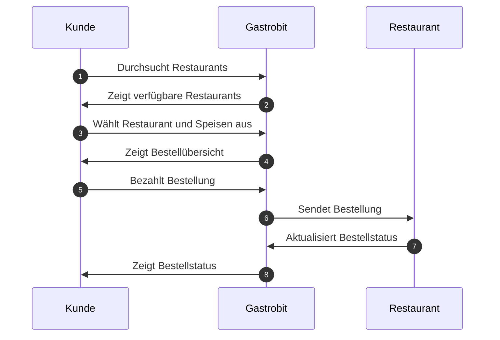
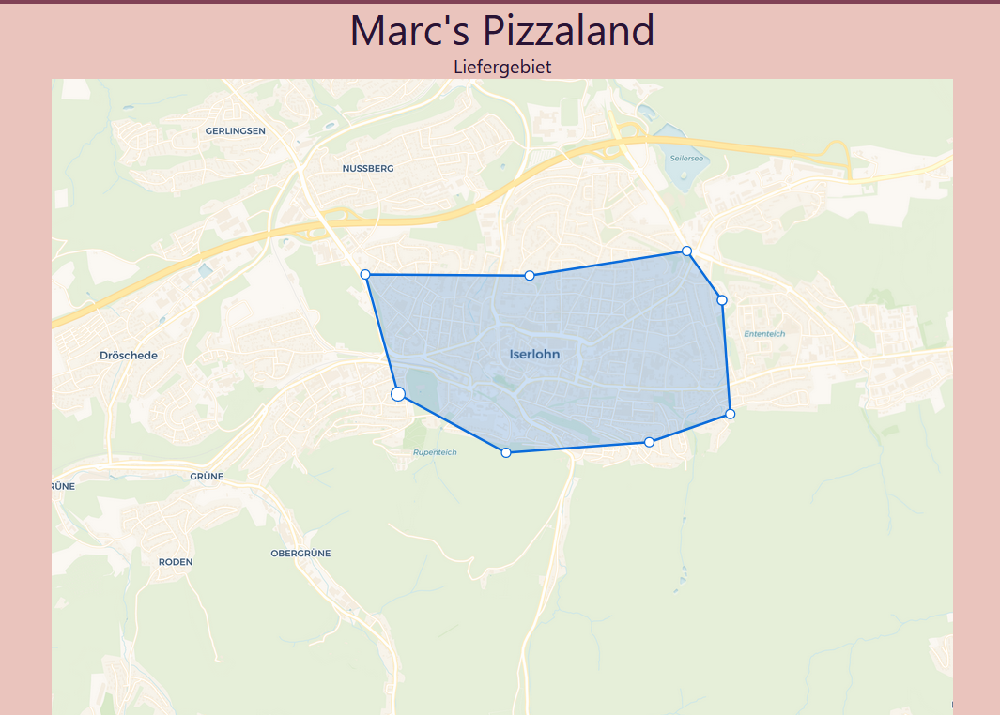

# Projekt - SS2023 - Gastrobit.de

| Name                  | Matrikelnummer | E-Mail                          |
| --------------------- | -------------- | ------------------------------- |
| Marc-Alexander Richts | 10059445       | richts.marc-alexander@fh-swf.de |

# Ausarbeitung: Entwicklung einer Alternative zu Lieferando

## 1. Ermittlung der Anforderungsaufnahme

Die Anforderungen für unsere Alternative zu Lieferando wurden durch eine Kombination aus Marktforschung und einem Gastronomeninterview ermittelt. Die Hauptanforderungen sind:

- Benutzerfreundliche Oberfläche
- Responsive Design für mobile Endgeräte beim Kaufvorgang durch Endkunden
- Einfache Bestellprozesse für den Endkunden
- Bezahlungsfunktion
- Restaurantverwaltung durch den Besitzer (Speisekarte, Erreichbarkeit über eigene Domain/\*.gastrobit.de-Subdomain, Auswahl eines Designs, Festlegung des Liefergebietes, etc.)
- Tracking und Verwaltung des Bestellvorgangs
- Niedrige Kommissionen für Gastronomen

## 2. Identifikation der Anwendungsfälle des Softwareprodukts

Die Anwendungsfälle für unser Produkt wurden identifiziert und in einem Use Case Diagramm dargestellt. Die Hauptanwendungsfälle sind:

- Registrierung, Login, Passwort zurücksetzen sowie E-Mail ändern für Gastronomen
- Hinzufügen und Verwalten von Restaurants durch den Gastronomen
- Übersicht über Umsätze von den einzelnen Restaurants
- Ändern von Gerichten auf der Speisekarte durch den Gastronomen (Extras (z.B. Käse, Zwiebeln, etc.), Preise, Varianten (große Pizza, kleiner Pizza), Gerichte kategorisieren, etc.)
- Bestellung von Gerichten durch Endkunden
- Bezahlung der Bestellung durch Endkunden
- Verwaltung der Bestellung durch den Gastronomen

## 3. Entwurf einer Benutzungsoberfläche für das Produkt

Die Benutzungsoberfläche wurde mit Wireframes entworfen, um eine benutzerfreundliche und intuitive Navigation zu gewährleisten. Die Hauptelemente der Benutzungsoberfläche sind:

- Startseite mit Übersicht über Restaurants die im Besitz des Gastronomen sind
- Verwaltungsfunktion für Restaurants (festlegen von Domains, Liefergebiet, etc.)
- Restaurantseite mit Speisekarte und Bestellfunktion und Bezahlmöglichkeit für Endkunden

Die Wireframes sind im Anhang A zu finden.

## 4. Herleitung eines Datenmodells

Das Datenmodell wurde auf Basis der identifizierten Anforderungen und Anwendungsfälle erstellt. Es besteht aus folgenden Tabellen:

- Restaurants
- Custom Domains
- Orders
- Users (Verwaltet durch Supabase)

### 4.1 Restaurants
Diese Tabelle speichert alle Restaurants, die von Gastronomen erstellt wurden. Sie enthält alle wichtigen Informationen, wie beispielsweise den Namen des Restaurants, die User-ID des Gastronomen, die ID des Stripe-Subaccounts (Connect-Express-Account) sowie die Speisekarte als JSON und das Liefergebiet als Koordinatenarray (Längengrad und Breitengrad), welches ein geschlossenes Polygon ergibt.

#### Warum wird die Speisekarte als JSON gespeichert?

Hier wäre die Chance gewesen, um eine weitere Tabelle zu erstellen und eine 1:n-Beziehung zwischen Restaurant und Gerichten zu erstellen. Allerdings ist die Speisekarte ein sehr komplexes Objekt, welches viele Eigenschaften hat und mit den Extra-Attributen, Varianten und verschiedenen Preisen wären die JOINs sehr komplex geworden. Zudem wird die Speisekarte *immer* komplett an den Nutzer ausgegeben, und es werden keine Teilabfragen benötigt. Daher war es für uns sinnvoller, die Speisekarte als JSON zu speichern.

#### Polygon? Liefergebiet?

Wir hatten mehrere Ansätze um ein Liefergebiet zu definieren.

1. **Radius um das Restaurant.** Dies wäre der simpelste Ansatz gewesen, jedoch fallen hier schnell die Limitierungen dieser unflexiblen Lösung auf: Nehmen wir einfach die Stadt Hamburg, die durch die Elbe horizontal getrennt ist. Ein Gastronom möchte beispielsweise in Hamburg nur den nördlichen Teil der Elbe bedinenen, da eine Fahrt durch den Elbtunnel für den Lieferanten zu lange dauert. Ein primitiver Radius würde dies nicht ermöglichen.

2. **Postleitzahlen.** Ein ähnliches Gebiet wie bei dem Radius: Postleitzahlengebiete sind teilweise sehr groß und können Gebiete abdecken, die durch große Hindernisse (wie der oben beschriebene Elbtunnel) geographisch getrennt sind. Außerdem war es mir nicht möglich, eine Datenbank mit Postleitzahlen zu finden, die auch die Koordinaten der Postleitzahlen enthält.

3. **Polygon.** Ein Polygon ist ein geschlossenes Gebiet, welches durch Koordinaten definiert wird. Dies ermöglicht es, sehr komplexe Gebiete zu definieren, die auch natürliche Hindernisse wie Flüsse oder Autobahnen berücksichtigen. *Für diesen Ansatz habe ich sehr viel Zeit benötigt, und wollte zuerst um Leaflet.js einen Wrapper schreiben, habe jedoch nach einigen Tagen die tolle Library "react-polygon-editor" vom Hamburger Taxiunternehmen "Freenow" gefunden. Beim Bestellprozess wird nun OpenStreetMaps.com mit der Adresse des Kunden kontaktiert, diese Adresse wird zu Koordinaten aufgelöst, und dann wird mit der Hilfe des "Point Inclusion in Polygon Test"-Algortihmus festgestellt, ob sich dieser Punkt im Polygon befindet. **Dies ist die finale Lösung, die in diesem Projekt verwendet wurde**. 

## 5. Beschreibung der zentralen eingesetzten Algorithmen

### 5.1 Liefergebiet

## 6. Geplante Abnahmetests zur Validierung der Anforderungen

Die Abnahmetests werden durchgeführt, um die korrekte Funktionalität des Produkts zu überprüfen und sicherzustellen, dass alle Anforderungen erfüllt sind. Sie umfassen unter anderem:

- Testen der Registrierungs- und Login-Funktionen
- Testen der Suchfunktion für Restaurants
- Testen des Bestellprozesses und der Bezahlung
- Testen der Restaurantverwaltung durch den Gastronomen

## 7. Geplante Inbetriebnahme auf technischer Ebene

Die Inbetriebnahme umfasst die Installation und Konfiguration des Servers, die Einrichtung der Datenbank und die Bereitstellung der Anwendung im Internet.

## 8. Einführung der Nutzung des Produkts durch den Endnutzer

Die Einführung der Nutzung des Produkts durch den Endnutzer umfasst die Erstellung von Benutzerhandbüchern und Schulungsunterlagen sowie die Durchführung von Schulungen für Gastronomen.

https://gastrobit.de/api/stripe/webhook

https://dashboard.stripe.com/test/webhooks/create?endpoint_location

Quellen und verwendete Libraries:

- [https://github.com/freenowtech/react-polygon-editor](@freenow/react-polygon-editor) - Polygon-Editor zum editieren des Liefergebiets
- [https://github.com/clauderic/dnd-kit](@dnd-kit/core) - Drag and Drop Library für React
